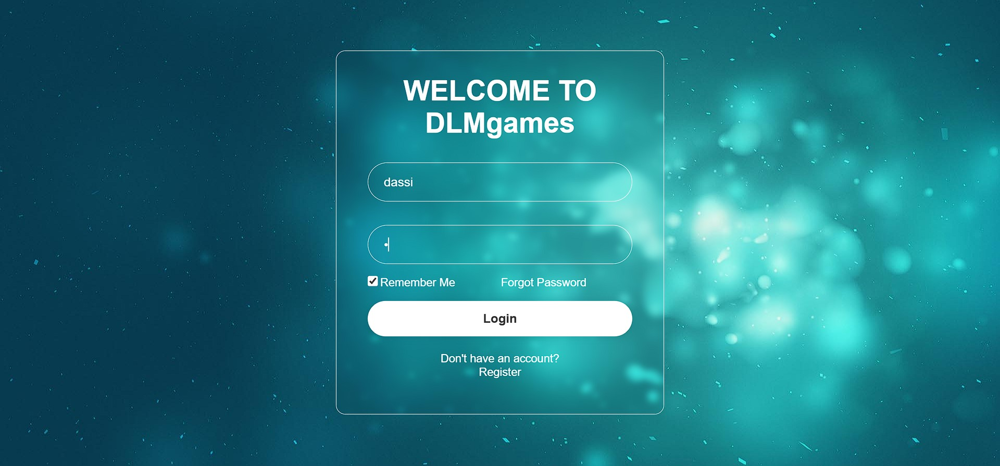
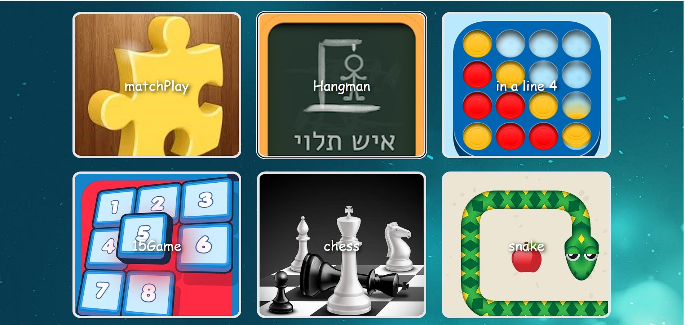
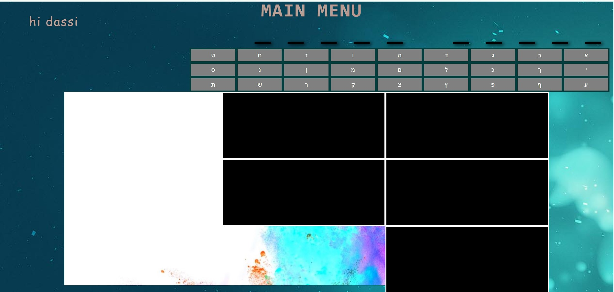
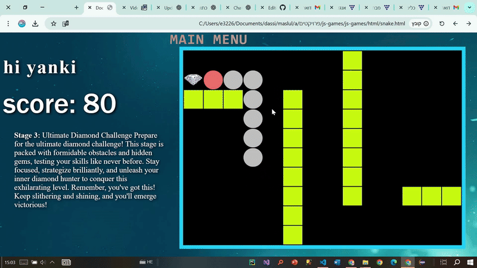
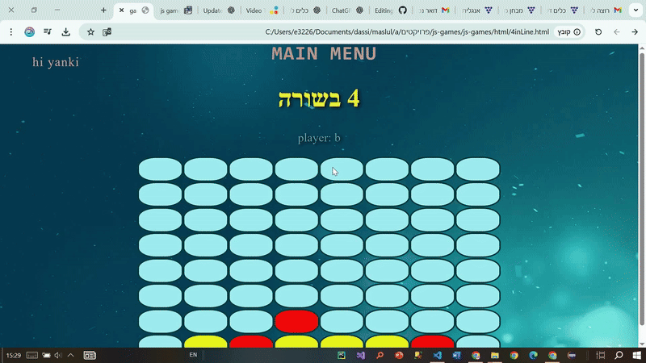
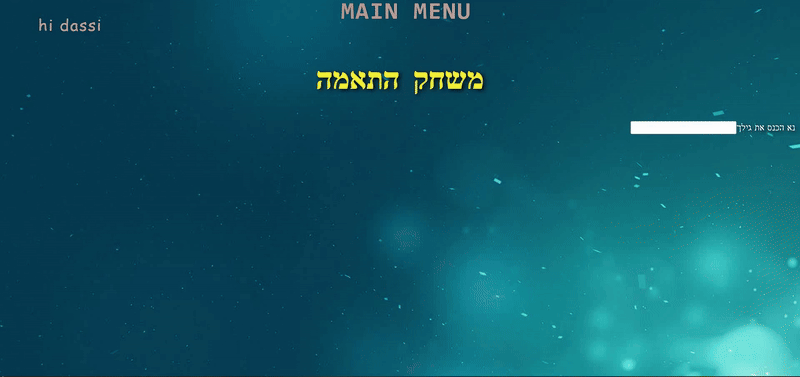

# FunJS Games

A collection of fun and interactive JavaScript games designed for all ages.  
The project includes several mini-games with customization options, score tracking, and a user-friendly interface.

---

## 🎮 Games Included
- **Smart Snake** – A classic Snake game with improved logic.  
- **Connect Four (2-Player)** – Challenge a friend in a 4-in-a-row game.  
- **Hangman** – Available in both Hebrew and English.  
- **Matching Game** – Age-appropriate card matching game.

---

## 🛠️ Technologies Used
- HTML  
- JavaScript  
- CSS  
- **LocalStorage** for saving preferences and scores  
- Type conversions for smooth functionality

---

## ✨ Features
- Save high scores  
- Save preferred colors and fonts  
- Age-based game customization  
- Display of top players

---

## 📂 Project Structure
```bash
.git/
css/
html/
js/
pic/
סאונד/  # Sound folder
README.md
```
The entry point is `html/login1.html`, which leads to the main games page.  
No additional setup is required; open the file directly in your browser.

---

## 🚀 Getting Started
1. Clone this repository:
    ```bash
    git clone https://github.com/DassiErenshtein/js-games.git
    ```
2. Open `html/login1.html` in your browser.  
3. Start playing! 🎉

---

## 🖼️ Screenshots
### Login Or Register

### Main Menu

### Hang Man


---

## 🎥 Demo Video
### Snake

### 4 In Row

### Match Play


---

## 🎥 Demo Video
To embed a demo video (GIF or video link):
```markdown

```
Or, you can link to YouTube:
```markdown
[Watch the demo video](https://youtube.com/your-video-link)
```

---

## 📜 License
No license specified.

---
